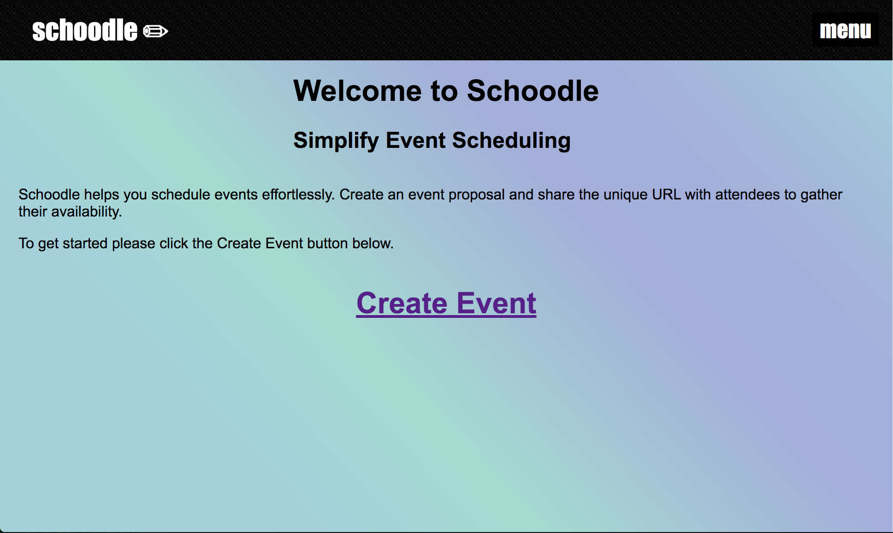
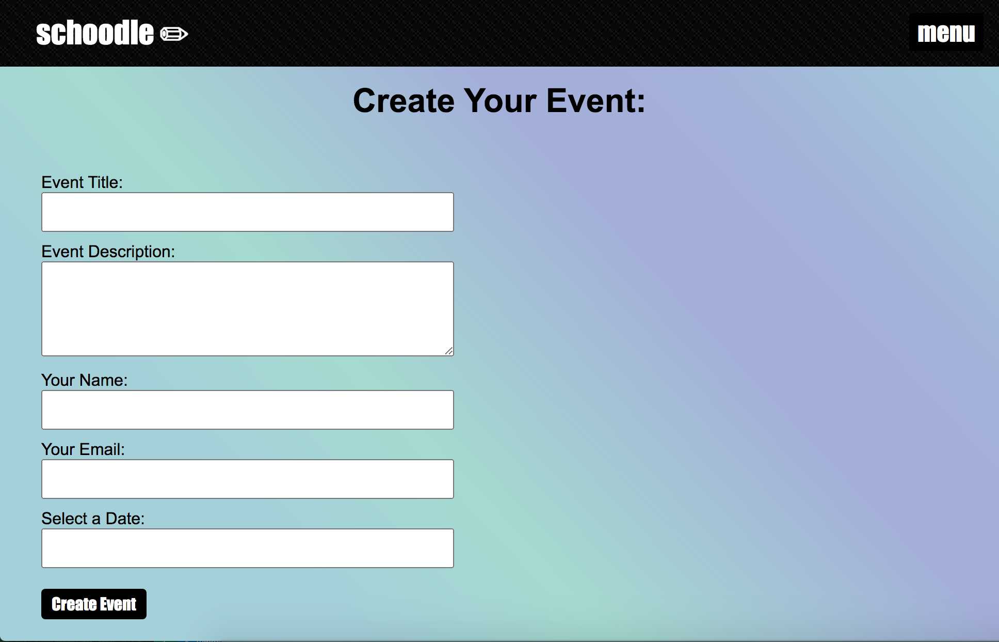
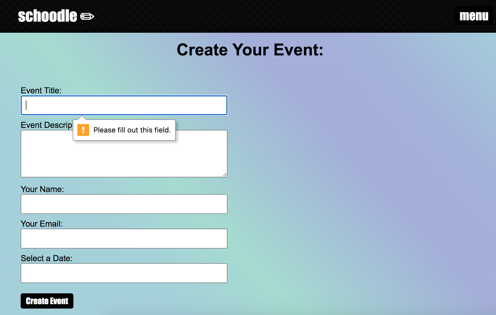
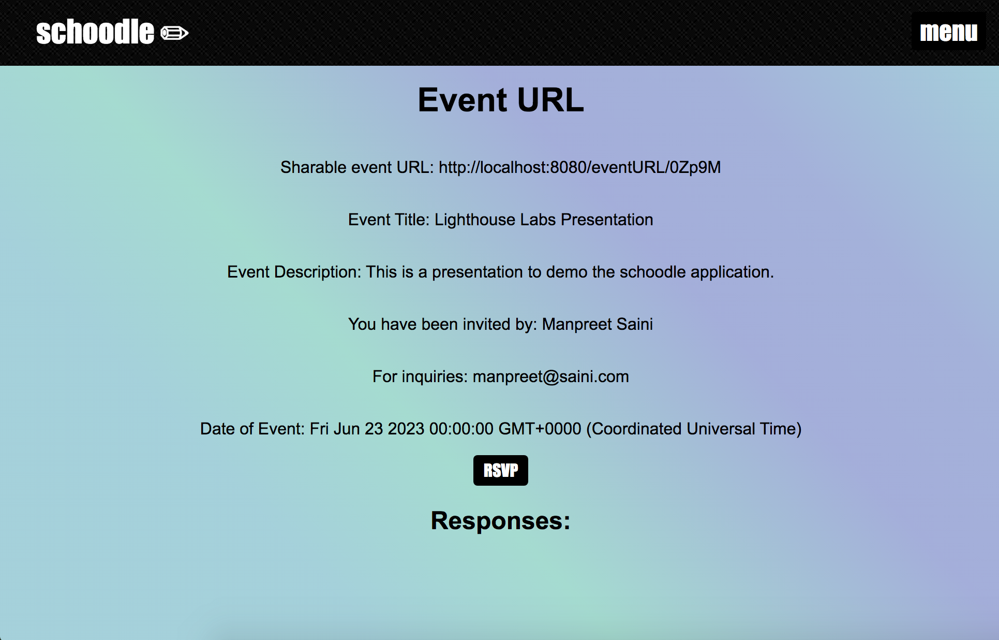
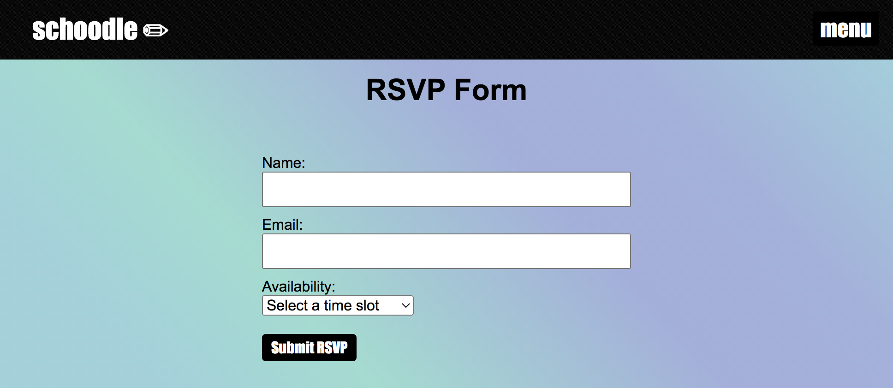
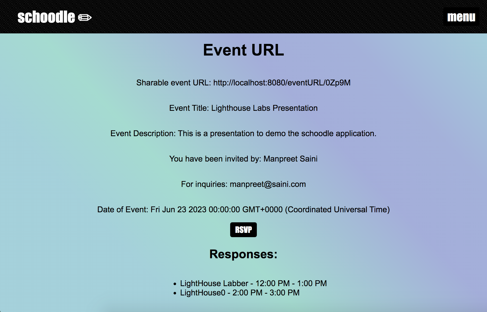
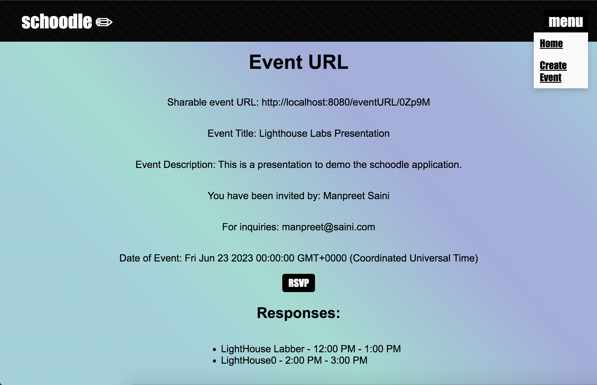

# Schoodle

Schoodle is a web application that allows users to create events, invite attendees, and collect RSVP responses. It simplifies event planning by providing a platform to manage event details and attendee availability.

## Features

    Create events with titles, descriptions, dates, and unique URLs
    Share event URLs with attendees for RSVP
    Collect RSVP responses including name, email, and availability
    View event details and RSVP responses
    Easily manage event planning and attendee coordination

## Technologies Used

    Node.js
    Express.js
    PostgreSQL
    EJS (Embedded JavaScript) for templating
    HTML and CSS for front-end design
    JavaScript for interactivity
    AJAX for asynchronous data handling

## Setup

    Clone the repository from GitHub.
    Install the required dependencies using npm install.
    Set up a PostgreSQL database and configure the connection details in .env file.
    Start the server using npm start.
    Access the application in your web browser at http://localhost:8080.

## Usage

    Navigate to the home page to create a new event.
    Fill in the event details such as title, description, organizer name, organizer email, and event date.
    Upon submission, a unique URL will be generated for the event.
    Share the generated URL with attendees.
    Attendees can visit the event URL to view event details and RSVP.
    The RSVP form requires attendees to provide their name, email, and availability.
    Upon RSVP submission, the response will be stored in the database.
    The organizer can access the event URL to view RSVP responses.
    The responses will include the name and availability of the attendees.
    Manage and coordinate the event based on the collected responses.

## Acknowledgements

    This project was developed as part of a coding assignment from Lighthouse Labs.
    Special thanks to the contributors and maintainers of the open-source libraries used in this project.

### Home Page

### Create Event

### Error Handling

### Event URL

### RSVP

### Response

### Menu drop down

